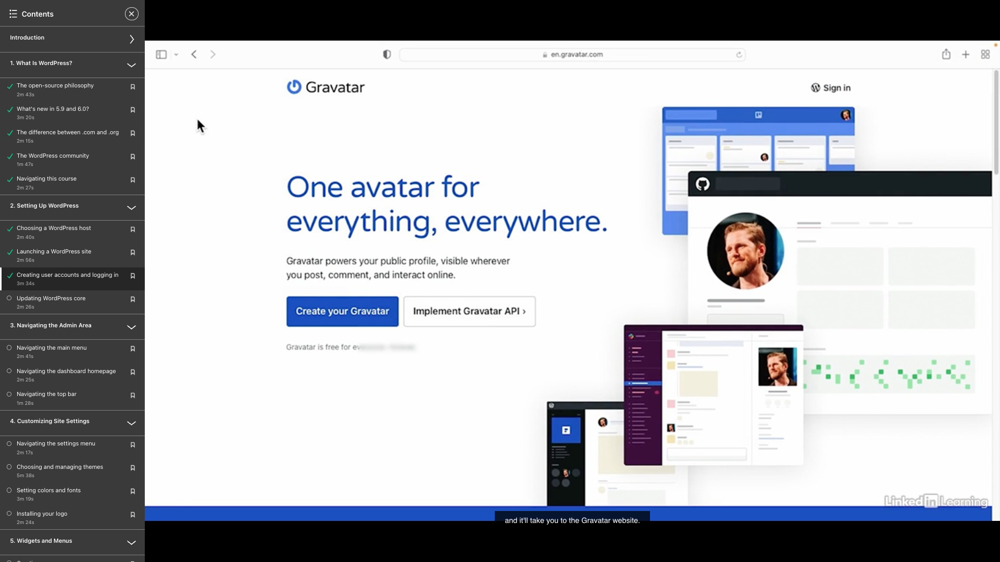

## WordPress Hosting (.com Service)

Managed WordPress Hosting

-   Environment designed for WordPress software
-   Trained support team, Quick-install tools
-   Features and optimizations designed for WordPress

## WordPress Launching (.org Installation)

One click install process, like the following shows 

## WordPress - Admin Page - `/wp-admin`

Use the specific domain + `/wp-admin` to login with the admin account

## WordPress - User Account

User roles 

(You should keep the number of admin account to a minimum)

Adding User 

Gravatar (User Profile)

