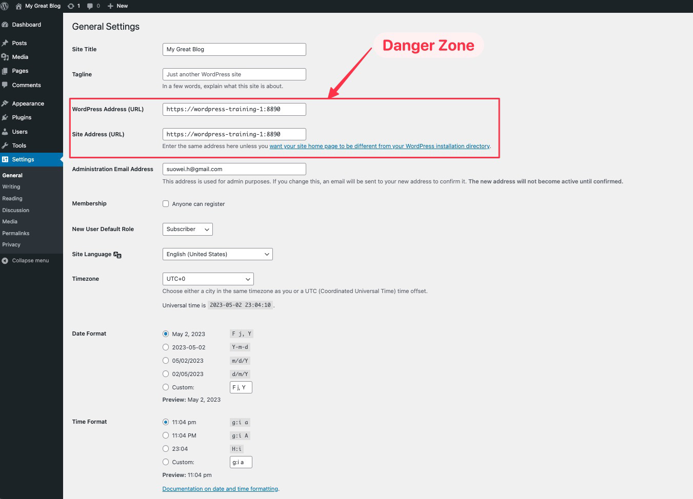
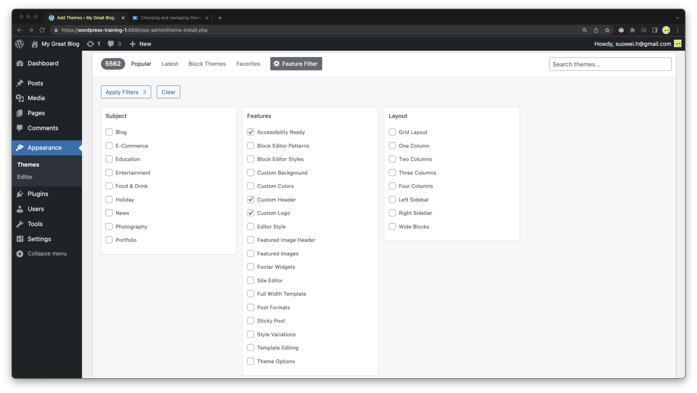

# WordPress Site Settings 

[TOC]

## Overview of Setting

#### Settings > General 

 

#### Settings > Writting 

 

#### Settings > Reading 

 

## Initial Must-have Config

### Site Name 

1.   The `title/name` of the website 

       

### TimeZone

2.   The `timezone`     of the website 

       

### SEO Crawling 

3.   Make sure the `[] discourage search engine from indexing this site` is turned on 

     (so that the visitors do not get sent to your half-finished website)

      

## Theming 

### How to choose a theme 

-   Determining whether you need a premium or free theme 
    -   **Divi by Elegant Themes:** 
        -   Divi is a multipurpose theme that is known for its flexibility and ease of use. It comes with a drag-and-drop page builder that allows users to create custom layouts without any coding knowledge.
    -   **Astra**: 
        -   Astra is a lightweight and customizable theme that is known for its speed and performance. It comes with many pre-designed templates that are suitable for a wide range of industries.
    -   **Avada**: 
        -   Avada is a versatile and feature-rich theme that is designed for a wide range of businesses and industries. It comes with a powerful page builder, customizable design options, and a range of pre-designed templates.
    -   **Genesis Framework**: 
        -   Genesis Framework is a popular theme for bloggers and content creators. It provides a solid foundation for building fast and secure WordPress websites, and it is highly customizable.
    -   **OceanWP**: 
        -   OceanWP is a free and customizable theme that is optimized for speed and performance. It comes with many pre-designed templates and integrates with popular page builders for easy customization.
-   If using a premium theme, use highly vetted ones 
-   loook up recent update and active support (security update are important !!!!)

### Filtering Theem (Finding the Theme Accoring to Criteria) 

 Consider you are in need of building a blog which is:

-   Accessibility Ready
-   Custom Colors
-   Custom Header
-   Custom Logo
-   Need a left hand side bar

Then you could use `Appearance > Themes > Feature Filter`, and configure like the following to find your theme 

 

 

### Updating Theme

#### Before updating your theme (backup)

-   Make a full backup of your website
-   Read the release notes
-   Ensure you're using the right version of WordPress core

## Logo

Customize your logo via `appearance > customize > `

 

Find the site identitity option 

