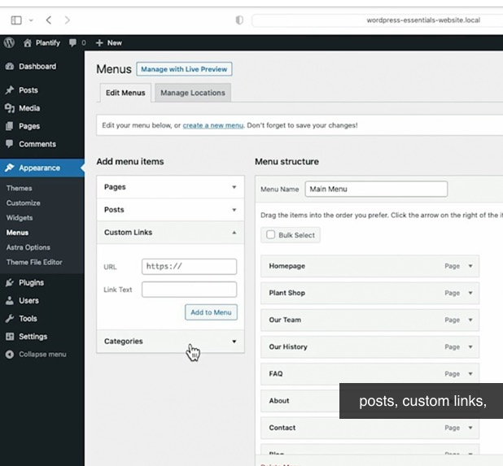

# HEADER - TYPICALLY BUILT WITH MENUS

## Older method (for old site)

1.   Go to "appearance > menu"

2.   Main menu that will appear on all pages 

    

3.   Order and perform nesting to website by dragging 

 

## Newer method (for new site 5.9+ or new theme)

1.   Go to "appearance > editor"

2.   Go to "template parts > header"

        

3.   Order / Align / Perform nesting as you wish 

      

(Notice that premium theme may provide other styling and customization options)

## Editing Header Styles (Font, Size, etc)

 

 

# FOOTER - TYPICALLY BUILT WITH WIDGET

1.   Go to "appearance > editor"

2.   Scroll down to the very bottom of the page        /    Or go to "building bock > footer "

      

     

     

