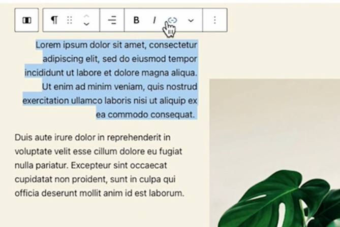

This secton of tutorial is rather straight forward, hence I will not take note in too fine grain of a detail

You can add as many blocks as much in a single page as you like to build a complex page, steps to build a block: 

Create a new block (either via keyboard `/ back-slash` or using the GUI inline / on the top of the page)

![2023.06.16 - 13_40_10 -  [Google Chrome-Adding a new block] -](assets/2023.06.16%20-%2013_40_10%20-%20%20%5BGoogle%20Chrome-Adding%20a%20new%20block%5D%20-.jpg)![2023.06.16 - 13_41_04 -  [Google Chrome-Adding a new block] -](assets/2023.06.16%20-%2013_41_04%20-%20%20%5BGoogle%20Chrome-Adding%20a%20new%20block%5D%20-.jpg)

Choose your desited content type 

![2023.06.16 - 13_41_55 -  [Google Chrome-Adding a new block] -](assets/2023.06.16%20-%2013_41_55%20-%20%20%5BGoogle%20Chrome-Adding%20a%20new%20block%5D%20-.jpg)

Block can nest under other blocks 

(they do not have to lay on top of each other, there could be hierachycal srtructure)

![2023.06.16 - 13_43_55 -  [Google Chrome-Adding a new block] -](assets/2023.06.16%20-%2013_43_55%20-%20%20%5BGoogle%20Chrome-Adding%20a%20new%20block%5D%20-.jpg) 

There's a library of blocks 

(You can install custom build block, for instance here the "accordion")

![2023.06.16 - 13_44_58 -  [Google Chrome-Adding a new block] -](assets/2023.06.16%20-%2013_44_58%20-%20%20%5BGoogle%20Chrome-Adding%20a%20new%20block%5D%20-.jpg) 

## Edit the Styling for Block

You can edit the block styling with the customization tool 

(both "image" and "text" has their control)

  

Whenever you select the block, you can make finer grain edit to the styling of the block via the sidebar 

(for instance for text you can have typography, color etc, for image you can have size, crop, color filter,  etc)

   

## Reusuable block

When you want to transform a block into a reusable block type, you can do the following 

(this will result in a block being searchable from a complete differnt page, reusbale block tab)

  

Whenever you  made changres to the reusbale block 

you can either made the change specific only to that instance of block

or make it appear on all the blocks, to do that you will need to perform as follows 

![2023.06.16 - 15_21_15 -  [Google Chrome-Using reusable blocks] -](assets/2023.06.16%20-%2015_21_15%20-%20%20%5BGoogle%20Chrome-Using%20reusable%20blocks%5D%20-.jpg) 

